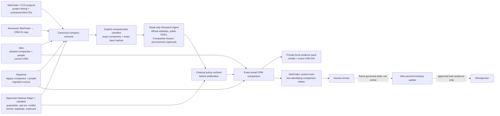

# SiteFinder research and outreach workflow

This is the operating model for finding relevant construction contacts across
the whole company portfolio—not only companies attached to a current
SiteFinder project.

## What each system does

- **SiteFinder** supplies project intelligence, timing and company join keys.
  It also hosts the read-only run/control/review interface.
- **Attio** is the intended current CRM and source of truth after cleanup.
- **Pipedrive** is the legacy migration source. It helps recover contacts and
  identify records that are missing from Attio.
- **Research Agent** is designed to enrich approved companies from the combined
  universe. Current shadow runs process one exact company or an explicitly
  reviewed pilot of up to 250 companies. It retains source evidence and
  determines whether each exact-email discovery is already in Attio, only in
  Pipedrive, absent from both, or conflicting.
- **Apollo** is an optional licensed business-data source. An operator must
  enable it for the run and confirm its search hostname. The API key remains in
  the private local worker environment, never the SiteFinder browser. Apollo
  email evidence is labelled as licensed and cannot pass the stricter
  public-email approval gate.
- **Woodpecker** remains the separate bulk-mail execution tool. Nothing in the
  research worker sends mail or automatically creates a Woodpecker audience.

## Safety gates now implemented

1. CRM and research data must stay in a private local directory outside Git,
   iCloud and other synced/network locations.
2. Snapshot, cleanup, company, pilot and output artifacts are hash-bound.
3. Empty, changed or unapproved cleanup ledgers fail before crawling.
4. Company names alone never merge records. Ambiguous domains, company
   numbers, legal forms and mappings go to review.
5. SiteFinder-to-CRM joins require an explicit reviewed source-ID mapping.
6. No-email discoveries, cleanup matches and conflicting CRM matches are held.
7. Pause/Stop control fails closed if its status cannot be verified.
8. The worker has no Attio/Pipedrive create, update or delete methods.
9. SiteFinder approval is a review decision only and does not authorise a CRM
   write or email send.
10. Approval requires a public work email, an eligible exact-email CRM result
    and at least 65% evidence confidence. The browser, server and database all
    enforce the same allowlist; a later unsafe comparison returns to pending.
11. Research candidates are not connected to the existing project Outreach
    queue. That separation remains intentional until the governed Attio
    writeback and bulk-audience design exists.
12. SiteFinder queues reviewed company/source requests; only the approved local
    worker consumes them. The worker validates its private cleanup and CRM
    snapshot prerequisites before claiming one run. Reviewed Companies House
    and procurement choices map to the existing read-only adapters.

## Current handoff from the Attio cleanup task

Before a real shadow pilot, place these outputs beneath
`RESEARCH_PRIVATE_DATA_DIRECTORY`:

- the complete deletion-safe Attio backup (kept separately from the worker);
- the cleanup decision ledger and matching approval manifest;
- protected/quarantine audit exports;
- a **post-cleanup** Attio operational snapshot and completion manifest;
- a current Pipedrive snapshot and completion manifest;
- reviewed SiteFinder-to-CRM identity resolutions where known;
- a reviewed 50-company pilot manifest bound to the exact company and people
  snapshot hashes.

The first real run remains read-only. Its success criteria are truthful
completion counts, zero cleanup-policy leaks, evidence quality, and accurate
CRM comparison—not how many contacts it can manufacture.

## Deliberately not active

- automatic deletion from Attio;
- automatic creation/update of Attio people;
- automatic Pipedrive-to-Attio writes;
- automatic Research-Agent-to-Outreach handoff;
- automatic Woodpecker upload or campaign launch;
- LinkedIn scraping or guessed/inferred email generation.

Those actions require a separate writeback design with a fresh transactional
cleanup/suppression check at the moment of change.
